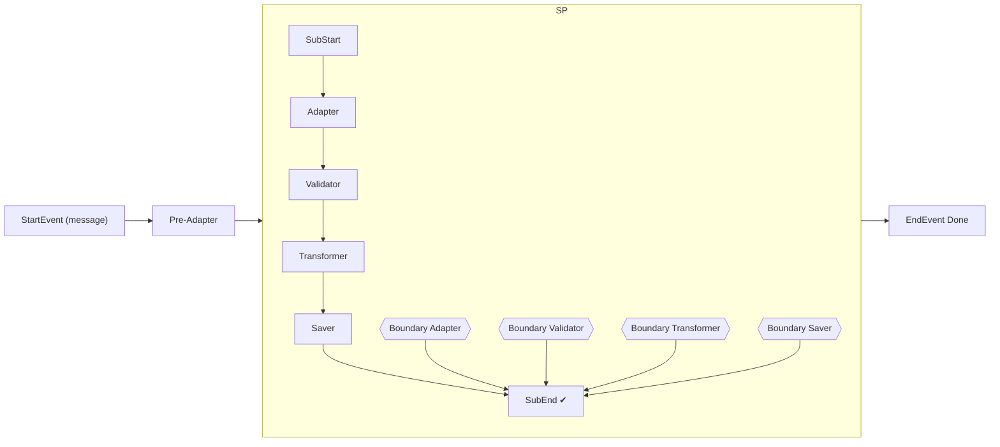
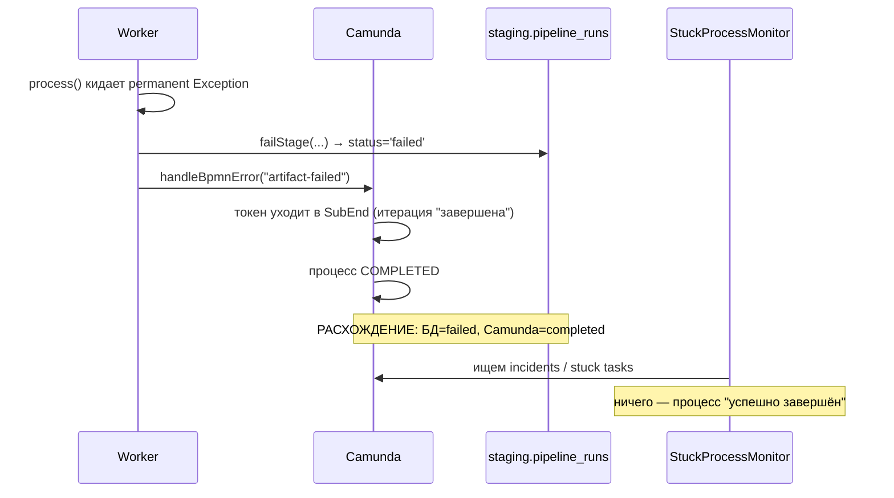

# Анализ: Boundary error в BPMN — проглатывает ошибку

> P3-2 из `.local/staging-refactor-mission.md`

## 1. Как устроен процесс сейчас

- Процесс [`artifact-pipeline-process.bpmn`](src/main/resources/bpmn/artifact-pipeline-process.bpmn:15):
  `Pre-Adapter` → `SubProcess_PerArtifact` (multi-instance `artifactRefs`),
  внутри — `Adapter → Validator → Transformer → Saver`, все external tasks.
- На каждом воркере — **boundary error event** с `errorRef="Error_ArtifactFailed"`
  (`errorCode="artifact-failed"`), `cancelActivity="true"`
  (строки [`artifact-pipeline-process.bpmn`](src/main/resources/bpmn/artifact-pipeline-process.bpmn:60), 77, 94, 111).
- Все 4 boundary-потока ведут в один и тот же **end event `SubEnd`**
  (строки [`artifact-pipeline-process.bpmn`](src/main/resources/bpmn/artifact-pipeline-process.bpmn:119)).
- «Ошибка» для Camunda — это
  `externalTaskService.handleBpmnError(taskId, workerId, "artifact-failed", msg)`
  из [`AbstractWorker.java`](src/main/java/ru/beeline/staging/worker/AbstractWorker.java:88).



## 2. Механика «проглатывания» — три слоя

### Слой 1. BPMN: boundary error ведёт в «успешный» end event

`SubEnd` принимает **5 входов**: один успешный (`SubFlow_5`) и **4 ошибочных**
(`SubFlow_AdapterError`…`SubFlow_SaverError`). Для движка нет разницы, как
пришёл токен — итерация multi-instance завершилась штатно, процесс уходит в
`EndEvent_1` и завершается **`COMPLETED`**. Ветки failure на уровне процесса нет
вообще — boundary error используется как «поймать и замолчать».

### Слой 2. Camunda: `handleBpmnError` не делает процесс failed

`handleBpmnError` — не отказ, а штатный рантайм-сценарий: бросает BPMN-ошибку,
которая матчится ближайшим error boundary event'ом. Инцидент не создаётся, retries
не сжигаются, процесс в итоге «успешно завершён».

### Слой 3. Приложение: двойная запись итога, противоречащая Camunda

Воркеры сами помечают run в БД как failed:

```java
// AdapterWorker: catch (Exception e) {
pipelineRunService.failStage(stageLogId, runId, "adapter", e.getMessage());  // БД: status='failed'
throw e;
// далее AbstractWorker: handleBpmnError(...) + throw new RuntimeException(e)
```

В итоге `pipeline_runs.status = 'failed'` (через [`PipelineRunService.failStage()`](src/main/java/ru/beeline/staging/service/PipelineRunService.java:142)
и [`markFailed()`](src/main/java/ru/beeline/staging/repository/PipelineRunRepository.java:24)),
а Camunda показывает `COMPLETED`.

## 3. Корневые причины

| № | Причина | Код |
|---|---------|-----|
| 1 | Boundary error → тот же «успешный» end event, нет ветки failure | [`artifact-pipeline-process.bpmn`](src/main/resources/bpmn/artifact-pipeline-process.bpmn:119) |
| 2 | Нет error end event / эскалации ошибки на уровень процесса | весь BPMN |
| 3 | `handleBpmnError` вместо `handleFailure` — для движка это успех | [`AbstractWorker.java`](src/main/java/ru/beeline/staging/worker/AbstractWorker.java:88) |
| 4 | `throw new RuntimeException(e)` после `handleBpmnError` — ошибка уже «съедена», incident не создаётся | [`AbstractWorker.java`](src/main/java/ru/beeline/staging/worker/AbstractWorker.java:95) |
| 5 | БД и Camunda пишут исход независимо и противоречиво | `failStage` + `handleBpmnError` |

## 4. К чему это приводит

### 4.1. Процесс в Camunda выглядит как успех

`EndEvent_1 Done`, статус `COMPLETED`, хотя артефакт не обработан. Нет инцидентов
→ нет алертинга.

### 4.2. Ложное «уже обработано» в идемпотентных проверках

[`PipelineRunService.isAlreadyFullyProcessed()`](src/main/java/ru/beeline/staging/service/PipelineRunService.java:94)
требует `run.status = 'completed'`. При boundary-ошибке на adapter/validator/transformer/saver
run помечен `failed` — следующий скан перезапустит обработку. Но если ошибка
случилась **вне BPMN** (например, publish в fdm-products после `completeRun`),
run может остаться `completed`, batch — `current`, и последующие сканы **молча
пропустят артефакт**, не доставив данные потребителям. Отсюда правило «furthest
point of failure»: раздельные коммиты canonical-save и publish уже учтены в
`isAlreadyFullyProcessed`, но только для BPMN-ошибок.

### 4.3. Разрыв источников истины

`PipelineRunDetails` (staging БД) показывает `failed`, а Camunda history
([`AdminController.history()`](src/main/java/ru/beeline/staging/controller/AdminController.java:116))
— `COMPLETED`. Диагностика и отчёты вводят в заблуждение.

### 4.4. Автовосстановление не срабатывает

[`StuckProcessMonitor`](src/main/java/ru/beeline/staging/service/StuckProcessMonitor.java:74)
лечит только таски с `noRetriesLeft()` и инциденты `FAILED_JOB_HANDLER`.
При «проглоченной» ошибке инцидента нет → `healIncidents()/healExternalTaskIncidents()`
не находят ничего; `checkLongRunningProcessInstances()` не находит, т.к. процесс
завершён.

### 4.5. Ручной retry бесполезен или перезапускает всё

[`PipelineRunService.retryFailedRun()`](src/main/java/ru/beeline/staging/service/PipelineRunService.java:179)
ищет активный external task по `executionId`/`camundaPid`, но процесс уже
завершён → сбрасывается 0 тасков, либо для scan-run всё перезапускается с нуля
(ветка в [`AdminController`](src/main/java/ru/beeline/staging/controller/AdminController.java:72)).

### 4.6. Потеря диагностики по батчу

Boundary error уводит итерацию в `SubEnd` без записи ошибки в переменные процесса
— нельзя построить сводку «какие артефакты батча упали» из данных Camunda.

## 5. Диаграмма текущего потока ошибки



## 6. Направления исправления (на будущее)

1. **Модель BPMN**: развести успех и ошибку — error handling внутри итерации должен
   заканчиваться **error end event** с эскалацией на уровень процесса (boundary
   event на subprocess) и **failed end event** на верхнем уровне, чтобы Camunda-инстанс
   реально завершался как failed.
2. **AbstractWorker**: либо `handleFailure` для этих тасков (инцидент + сработает
   `StuckProcessMonitor`), либо `handleBpmnError` с корректным флагированием
   процесса; убрать противоречивый код «получили ошибку → но процесс успешен».
3. **Единая точка принятия решения** об исходе запуска, чтобы `pipeline_runs` и
   Camunda были согласованы (сейчас их пишут независимо `failStage` и
   `handleBpmnError`).
4. **Не «съедать» отказ после `handleBpmnError`**: пересмотреть
   `throw new RuntimeException(e)` — либо явная failed-ветка, либо осознанный
   graceful-degradation путь для итерации.
